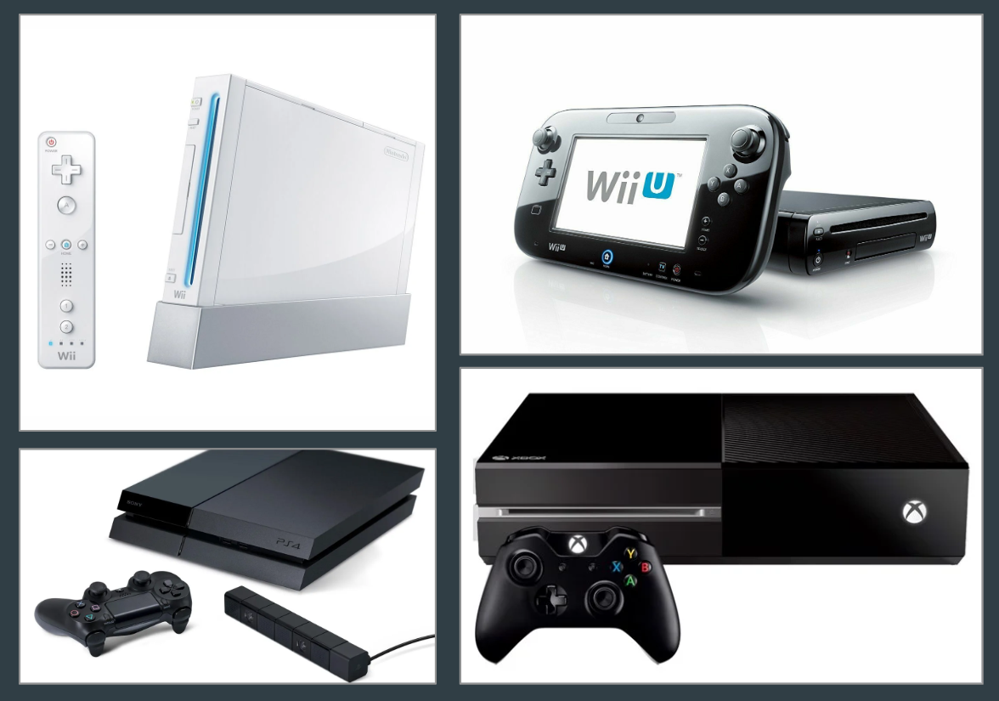
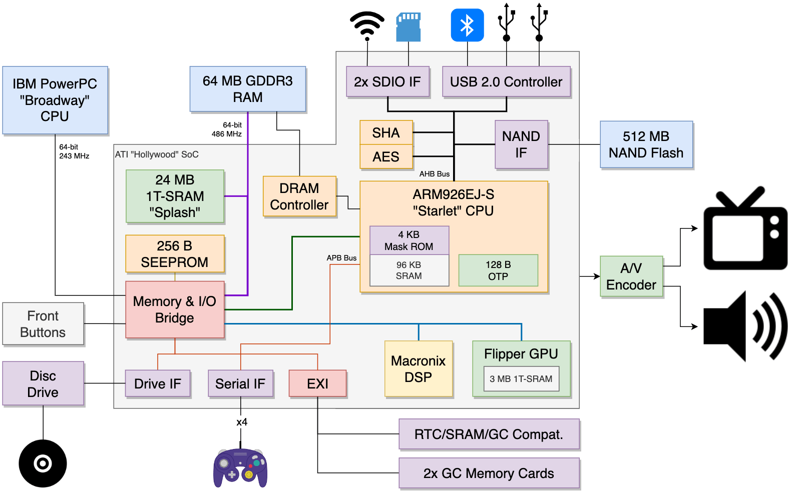
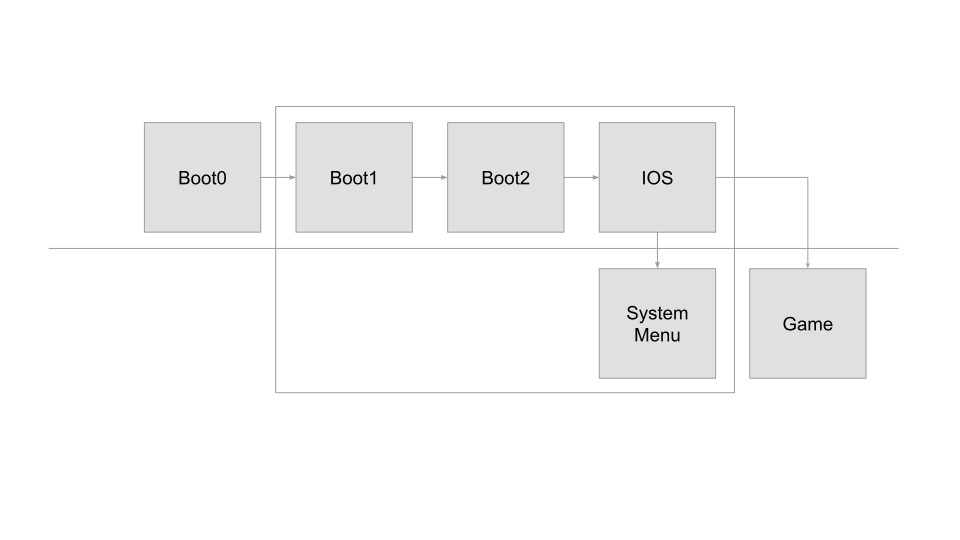
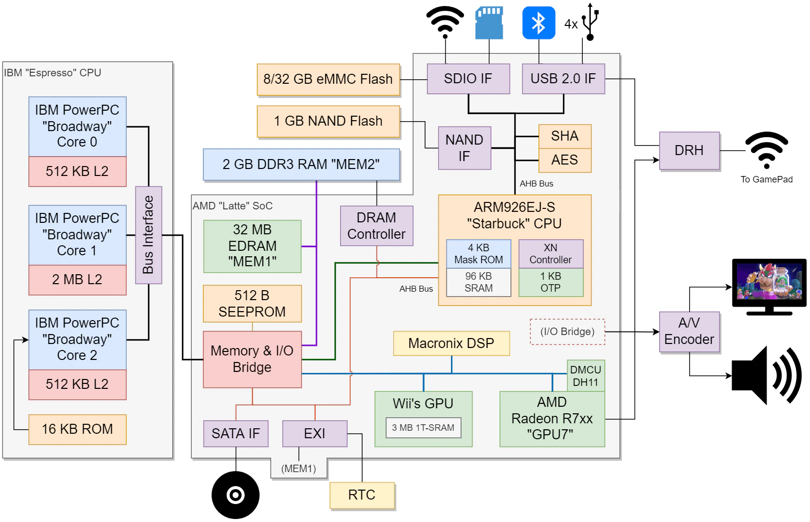
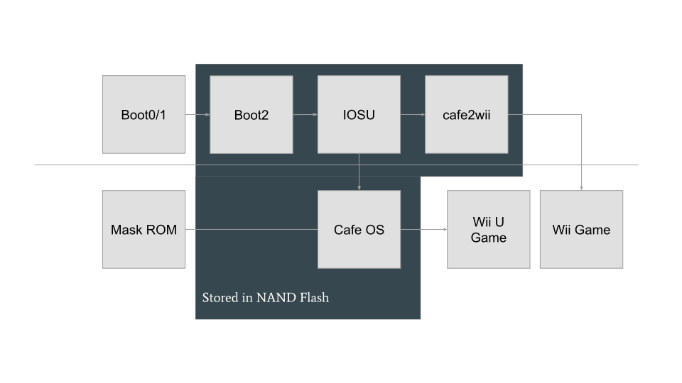
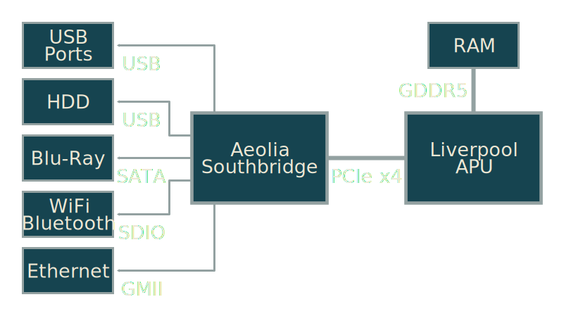
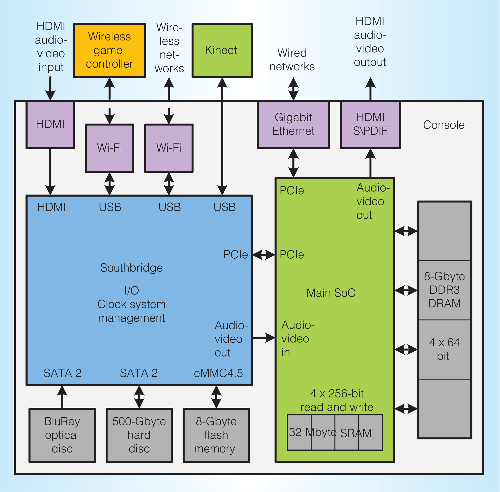

### `joshua@joshua-pc3 $ whoami`

Joshua Scarsbrook

Research Officer/PhD Student at the University of Queensland

Researching Applied Cyber Security and Cyber Security in Education

Interested in Operating Systems and Embedded Hardware

---

## Disclaimer

**I did not hack these consoles myself or develop the exploits.** All the content in this presentation is from publicly available sources online.

The main references I will be using are:

- [https://hackmii.com/](https://hackmii.com/) (Focuses on Nintendo Wii)
- [https://wiibrew.org/wiki/Main_Page](https://wiibrew.org/wiki/Main_Page) (Focuses on Nintendo Wii)
- [https://xosft.dev/wiki/](https://xosft.dev/wiki/) (Xbox One Research Wiki)
- [https://fail0verflow.com/blog/](https://fail0verflow.com/blog/) (Fail0verflow "focuses on Wii U and PS4")
- [https://www.copetti.org/writings/consoles/](https://www.copetti.org/writings/consoles/) (Great research on the hardware architecture of all consoles)
- [https://www.platformsecuritysummit.com/2019/speaker/chen/](https://www.platformsecuritysummit.com/2019/speaker/chen/) (Great talk by Tony Chen at Microsoft discussing the security architecture of the Xbox One)

---

## Overview

:::::::::::::: {.columns}
::: {.column width="40%"}

- What is a Console?
- Hardware Security Assumptions
- Nintendo Wii
  - System Architecture
  - Secure Boot Process
- Nintendo Wii U
  - System Architecture
  - Secure Boot Process
- Playstation 4
  - System Architecture
- Xbox One
  - System Architecture

:::
::: {.column width="60%"}

:::
::::::::::::::

---

## What is a PC?

^[Source https://fail0verflow.com/media/33c3-slides/#/24](https://fail0verflow.com/media/33c3-slides/#/24)^

- 8259 Programmable Interrupt Controller (PIC)
- 8253 Programmable Interval Timer (PIT)
- 8250 UART at I/O `3f8h`
- 8042 PS/2 Keyboard Controller
- MC146818 RTC/CMOS
- ISA bus
- VGA

---

## What is a Game Console?

### _Not a PC._

---

### PC Security Architecture

**TPM (Trusted Platform Module)**

Security microcontroller handling measurement and secure key storage.

**SGX (Software Guard Extensions)**

Provides application isolation using hardened enclaves.

**Intel CSME / AMD PSP / ARM TrustZone**

Embedded CPU core running manufacturer firmware providing bootstrap, security, and remote management.

::: {.smaller}
_Thanks Guangdong Bai for suggesting this slide._
:::

---

### Hardware Security Assumptions - What’s at Stake

::: {.smaller}

Only the CPU silicon die is trustworthy (not economically feasible to mod 28nm die).

- Intercepting and modifying data on any motherboard bus is easy.
- Any SoC external pin will be manipulated in the worst possible way. JTAG Debug, Clock, voltage, and reset pins are primary targets.
- All PCIe, SATA, USB data can certainly be manipulated.

Current PC hardware design is not resilient against hardware attacks:

- DRAM not encrypted or integrity protected
- Bus between CPU and South Bridge not protected.
  - Most of Intel’s “secure boot” functionality implemented in South Bridge.
  - At boot time, CPU asks South bridge (though insecure bus) whenever it needs to secure boot.
- TPM chip connected to CPU through insecure LPC bus. Any TPM measurement can be forged.

:::

[Source https://www.platformsecuritysummit.com/2019/speaker/chen/](https://www.platformsecuritysummit.com/2019/speaker/chen/)

---

## The Nintendo Wii

:::::::::::::: {.columns}
::: {.column width="35%"}
**Architecture:** GameCube++

**CPU:**

- IBM PowerPC “Broadway”
- ARM926EJ-S “Starlet”

**GPU:**

- ATI Graphics (ATI is now owned by AMD)
- GameCube's GPU

**RAM:** “It’s complicated”
:::
::: {.column width="65%"}

**Source:** [https://www.copetti.org/writings/consoles/wii/](https://www.copetti.org/writings/consoles/wii/)
:::
::::::::::::::

---

### Side Note: One-time Programmable Memory (OTP/eFUSEs)

Super common kind of memory in modern systems that is used to set system configuration at manufacturing time.

You don’t have enough money to reprogram them (requires specialized(/very expensive)) silicon rework hardware.

Common in lots of modern hardware:

- All the consoles we’re talking about.
- Most Android Phones.
- All iPhones/iPads/iOS devices.

---

## Wii: Starlet vs. Broadway

**Broadway (IBM PowerPC (PPC))**

- It’s where the games (and System Menu) run.
- Runs a Operating System called Revolution OS.
- Controlled by Starlet.

**Starlet (ARM)**

- It’s where the main “operating system” (IOS) runs.
- Connected to hardware.
- Handles the boot process for the rest of the system.

---

## Wii Operating System: IOS

- It’s not really a normal operating system.
- It’s a Microkernel (If you’ve used Minix before it looks familiar).
- It’s closest relative is Unix or Plan 9.
- The Wii stores multiple copies of IOS and games each target a specific version.
- The version of IOS being used can be changed easily.

---

---

## Notable Wii Exploits

**Tweezer Attack**

- Shorting address pins while in GameCube compatibility mode allowed dumping of memory.

**Twilight Hack**

- It’s a buffer overflow in the save data of The Legend of Zelda: Twilight Princess.

**Boot1 Fake-signing Bug**

- Allows replacing Boot2 with a custom executable. Gives full low-level control over the system.
  Not fixable in software since Boot1 can’t be updated.

---

## The Nintendo Wii U

:::::::::::::: {.columns}
::: {.column width="35%"}

**Architecture:** Wii++ (Not a PC)

**CPU:**

- 3 core IBM “Espresso”
- ARM “Starbuck”

**GPU:**

- Wii’s GPU (Based on ATI)
- AMD Radeon

**RAM:** 2 GB (+ some other bits)

:::
::: {.column width="65%"}

**Source:** [https://www.copetti.org/writings/consoles/wiiu/](https://www.copetti.org/writings/consoles/wiiu/)
:::
::::::::::::::

---

## Wii vs. Wii U: Overview

| **Wii**                                                                                                              | **Wii U**                                                                                                    |
| -------------------------------------------------------------------------------------------------------------------- | ------------------------------------------------------------------------------------------------------------ |
| Games run on the Broadway, on the bare metal.                                                                        | Runs Cafe OS, a custom multiprocess OS running on the Espresso with process isolation and memory management. |
| The Starlet runs IOS, a microkernel OS handling security, crypto and I/O services                                    | Similar, but IOS is larger and significantly changed (we call it IOSU).                                      |
| Games and software are loaded from disc or NAND flash. RSA signatures checked at installation time, not launch time. | Also includes 8 or 32GB of eMMC storage for user software. RSA signatures also checked at launch time.       |

[Source https://fail0verflow.com/media/30c3-slides/#/6](https://fail0verflow.com/media/30c3-slides/#/6)

---

---

## Wii U Exploits

**_Wii Compatibility Mode_ exploits**

- They got in through the Nintendo Wii compatibility mode.

**Nintendo**

- They left a memory flag to reenable boot0.
- They didn’t strip the symbols of cafe2wii.

**WebKit bugs**

- Incredibly common and super boring.

---

### The Sony Playstation 4: Overview

:::::::::::::: {.columns}
::: {.column width="35%"}

The most PC-like _not a PC_ we’ve seen so far.

- It has a x86_64 CPU
- It has a AMD GPU
- It runs FreeBSD

:::
::: {.column width="65%"}

:::
::::::::::::::

---

### The Sony Playstation 4

:::::::::::::: {.columns}
::: {.column width="35%"}

**Architecture:** Like a PC (but…)

**CPU:**

- AMD x86_64
- Marvell Armada (ARM)

**GPU:**

- AMD GCN “Sea Islands”

**RAM:** 8GB
:::
::: {.column width="65%"}

:::
::::::::::::::

---

## {data-background-image="./images/ps4-system-menu.jpg"}

It’s based on FreeBSD with plenty of modifications by Sony.

The PS3, PS4, and PS5 all use similar operating systems.

The system menu is written in C#.

---

### PS4 Exploits

- Webkit
- FreeBSD Kernel Exploits

---

### The Microsoft Xbox One

:::::::::::::: {.columns}
::: {.column width="50%"}

**Architecture:** Not a PC (not a PC4 either).

**CPUs:** AMD x86_64

**GPUs:** AMD Radeon

**RAM:** 8GB

**Operating System:** Windows

:::
::: {.column width="50%"}

:::
::::::::::::::

_Source: [https://xosft.dev/wiki/southbridge/](https://xosft.dev/wiki/southbridge/)_

---

## What is Windows?

:::::::::::::: {.columns}
::: {.column width="50%"}

**Windows NT Kernel**

- Uses native APIs.
- Internally structured like Unix but different.
- Uses UNC path notation as the “native” format.
- First released in 1993 (Happy Birthday in July).

:::
::: {.column width="50%"}

**Win32 APIs**

- First released in 1985.
- Uses `C:\` and other drive letters.
- Your Windows desktop and most Windows UI is provided by Win32.
- A completely different set of APIs to the NT Native APIs.

:::
::::::::::::::

All the Xbox consoles have used derivatives of Windows NT.

The Xbox One(/ Series X/S) run some Win32 APIs but not everything.

---

### Hypervisors on Game Consoles

:::::::::::::: {.columns}
::: {.column width="50%"}

**Does not have a Hypervisor**

- Playstation 4
- Nintendo Wii
- Nintendo Wii U
- Nintendo Switch

:::
::: {.column width="50%"}

**Has a Hypervisor**

- Playstation 3
- Playstation 5
- Xbox 360
- Xbox One
- Xbox Series S/X

:::
::::::::::::::

**What is a Hypervisor**

A Hypervisor virtualizes access to hardware resources. At a basic level it intercepts any hardware access and turns it into a protected interrupt.

---

### Xbox One Operating Systems

**Host OS:** Host operating system running modified Windows 8. No GUI presented to the User.

**System OS:** Runs the main UI and dashboard. Based on Windows 'OneCoreUAP'.

**Game/ERA OS:** Games run inside here. Uses Windows 8 like Host OS but modified.

---

### Xbox One Exploits

Nothing Notable.

---

### Developer Kits

- Requires a NDA to purchase (\*).
- Modern ones need regular internet access to work (\*).
- Generally the same hardware (maybe more networking or RAM).
  - _For the Xbox One it's exactly the same hardware. (\*)_
- Connects to a PC and runs development signed code (\*).
- Can't run retail games (\*).

---

### Other Consoles

**Playstation 3**

- Thoroughly compromised due to a signing bug in the system. (Similar to Nintendo Wii)
- Runs a similar operating system to the PS4 and weird hardware based on IBM’s Cell processor.

**Nintendo Switch**

- Uses a Nvidia Tegra SoC.
- Old consoles have a bootrom vulnerability granting low-level access.
- Runs a variant of the Nintendo 3DS’s operating system rather than something Wii/Wii U like.

**iPhone/iPad/Apple Silicon Macs**

- Not a game console but share a similar security architecture.

---

## {data-background-image="./images/ship_of_theseus.jpg"}

### What is a PC?

- ~~8259 Programmable Interrupt Controller (PIC)~~ _APIC_
- ~~8253 Programmable Interval Timer (PIT)~~ _APIC_
- ~~8250 UART at I/O `3f8h`~~ _USB_
- ~~8042 PS/2 Keyboard Controller~~ _USB_
- ~~MC146818 RTC/CMOS~~ _Part of the Southbridge_
- ~~ISA bus~~ _PCI Express_
- ~~VGA~~ _Discrete Graphics with a GPU_

PS4, Wii, Wii U support Linux.

Xbox One runs (modified) Windows.

::: {.smaller}
_Background Image Credit: Chatterton, E. Keble (Edward Keble), 1878–1944_

_[What is a PC source: https://fail0verflow.com/media/33c3-slides/#/24](https://fail0verflow.com/media/33c3-slides/#/24)_
:::

---

## Thanks for Listening
