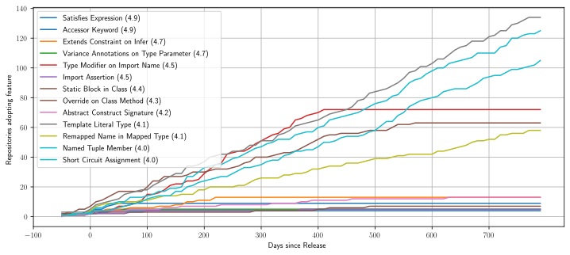
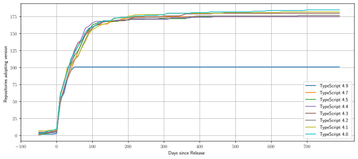

# Motivation

What features should we be studying...

- for Code Analysis?
- for Type Inference?
- for Developer Tooling?

How quickly do developers adopt new language versions?

# Research Questions

1. What are **the most popular features** recently introduced in _TypeScript_?
2. How **quickly are new _TypeScript_ features adopted** by projects that use _TypeScript_?
3. How **quickly are new _TypeScript_ language versions adopted** by projects that use _TypeScript_?

# Dataset / Methodology

1. Collect top stared repos from _GitHub_.
   - **500** repos filtered to **454** containing _TypeScript_ code.
2. Download all repos and all commits.
   - **1,325,810** total commits.
3. Filter for commits in the time period of interest.
   - Between **January 1st 2020** and **December 31st 2022** inclusive.
4. Analyze each _TypeScript_ file in each commit and look for usage of features.
   - Done by looking at _Abstract Syntax Tree_.

# Research Question 1

**What are the most popular features recently introduced in TypeScript?**

1. **Type Modifier on Import Name** _(70 Projects after 400 days of release)_
2. Template Literal Type _(67 Projects after 400 days of release)_
3. Named Tuple Member _(61 Projects after 400 days of release)_
4. Override on Class Method _(52 Projects after 400 days of release)_

# Research Question 2

**How quickly are new TypeScript features adopted by projects that use TypeScript?**

# Research Question 3

**How quickly are new TypeScript language versions adopted by projects that use TypeScript?**

# Thanks for Listening

**Source Code:** [https://github.com/Vbitz/jsdata_msr](https://github.com/Vbitz/jsdata_msr)
